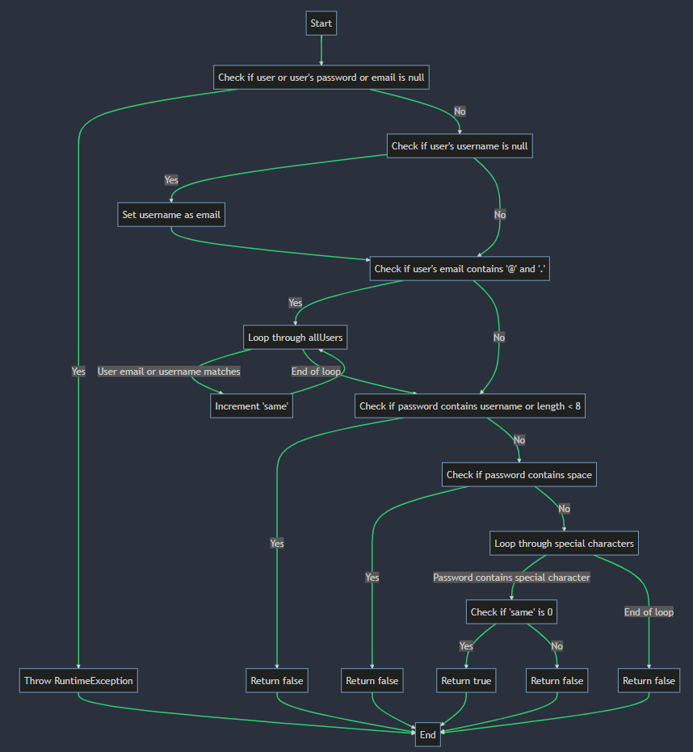

# Втора лабораториска вежба по Софтверско инженерство

## Горјан Илијевски, бр. на индекс 213107

### Control Flow Graph

### Цикломатска комплексност

Формулата за пресметување на цикломатска комплексност (M) е:

M = E - N + 2P

каде:

E е бројот на рабови (преноси на контрола)
N е бројот на јазли (секвенцијални групи на изјави кои содржат само еден пренос на контрола)
P е бројот на поврзани компоненти (обично 1 за добро структурирана програма)
Во дадениот код, имаме:

8 точки за одлука (изјави if и for loops)
1 излезна точка (крај на функцијата)
Значи, цикломатската комплексност е 8 (точки за одлука) + 1 (излезна точка) = 9.

Ова значи дека има 9 линеарно независни патеки низ кодот. Ова е умерен ниво на комплексност. Како општо правило, цикломатска комплексност под 10 се смета за добра, помеѓу 10 и 20 е умерена, а над 20 е висока и може да биде знак дека кодот треба да се рефакторира зада се намали комплексноста.

### Тест случаи според критериумот Every statement

....

### Тест случаи според критериумот Every path

....

### Објаснување на напишаните unit tests

...
...
